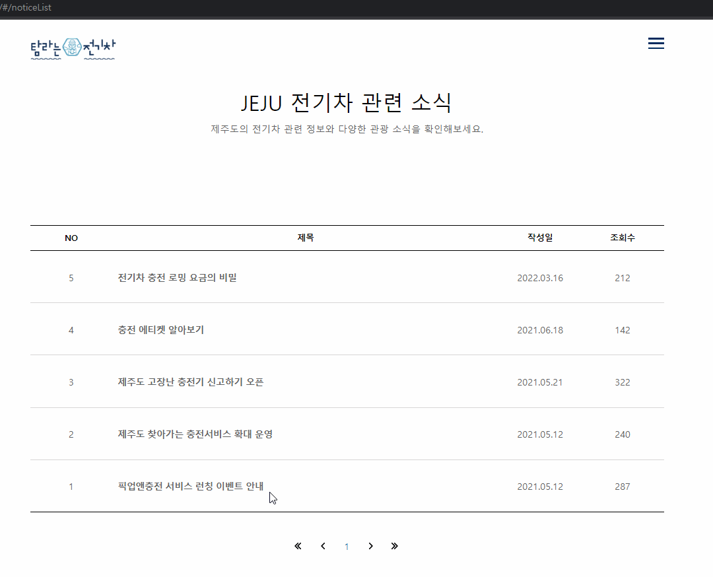
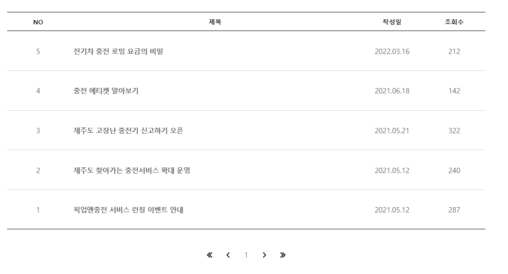

a# PP-tamraev-clone_coding

## React-Router 연습 클론 코딩 (개인 프로젝트)

| FE | 이상연 | [@yeonhub](https://github.com/yeonhub) |
| -- | ------ | ----------------------------------- |

## 클론 사이트

[](https://www.tamraev.com)

## 프로젝트 기술 스택

  

## 컴포넌트 구조

```javascript
src	┌	assets	-	api	┌	main.js
	│				└	notice.js
	├	components	┌	Footer.js
    	│			├	Header.js
    	│    	        	└	Popup.js
    	└	pages	┌   Home.jsx
                	├   Info.jsx
                	├   Privacy.jsx
                	├   Terms.jsx
                	├   NoticeList.jsx
                	├   NotiveLayout.jsx
                	└   NoticeDetail.jsx
```

## 프로젝트 캡쳐


## 기능 구현

<br>

### 1) Router

이번 클론 코딩에서 익혀야 할 기술은 React-Router이다.

```javascript
const App = () => {
  return (
    <>
      <div id='wrap'>
        <BrowserRouter >

	// header와 footer는 어느 페이지든 나오는 컴포넌트 이므로
	// Routes 밖에서 호출했다.

          <Header />
          <Routes>
            <Route path='/' element={<Home />} />
            <Route path='/info' element={<Info />} />
            <Route path='/terms' element={<Terms />} />
            <Route path='/privacy' element={<Privacy />} />
            <Route path='/electronicList' element={<ElectronicList />} />

	// Notice의 경우 header처럼 상단에 항상 표시되는 컴포넌트가 있기에
	// Layout, Outlet을 사용했다.

            <Route path='/noticeList' element={<NoticeLayout />}>
              <Route index element={<Noticelist/>}/>

	// 게시글의 data중 id가 페이지 번호가 되도록 path 작성

              <Route path=':id' element={<NoticeDetail />} />
            </Route>
          </Routes>
          <Footer />
        </BrowserRouter>
      </div>

	// 공틍으로 적용 할 styled-component

      <GlobalStyle />
    </>
  );
};
```



```java
const NoticeLayout = () => {
    return (
        <ContainerNoticeLayout>

	// Notice 페이지에서 공통으로 출력할 부분

            <div id="container">
                <div className="inner">
                    <h3>JEJU 전기차 관련 소식</h3>
                    <p className="sub_tit">제주도의 전기차 관련 정보와 다양한 관광 소식을 확인해보세요.</p>
                    <Outlet />
                </div>
            </div>
        </ContainerNoticeLayout>
    );
};
```

### 2) Styled-Components

css나 scss가 아닌 Styled-Components 사용해 style을 적용했다.

```javascript
	// styled-components 라이브러리 import

import styled from 'styled-components';

	// Info 페이지 style 작성

const ContainerInfo = styled.div`
 #container {
  position: relative;

  &::before {
    content: '';
    position: relative;
    width: 100%;
    height: 1056px;
    background: #f6f3f2;
    display: block;
    position: absolute;
    bottom: 0;
    z-index: 1;
  }

  .inner {
    position: relative;
    width: 1200px;
    color: #fff;
    z-index: 2;
    margin: 0 auto;
  }
}
`
const Info = () => {
    return (

	// styled-components에서 선언한 변수명으로 호출

        <ContainerInfo>
            <div id="container">
	.
	.
	.
```

### 3) 페이지에 따른 태그 class, img src 변경


Home의 경우 Header의 class가 적용되어 있지 않지만, 다른 페이지로 넘어갈 경우 배경색 때문에 logo와 햄버거 메뉴가 보이지 않기 때문에 blue라는 class를 붙여주었다.

```javascript
const Header = () => {

	// 현제 페이지를 담는 변수 location 생성

  const location = useLocation();

	// location이 첫 페이지인 경우 headerClass는 공백, 아닌경우 'blue'
	// logoClass의 경우 공백 또는 '_b'

  const headerClass = location.pathname === '/' ? '' : 'blue';
  const logoClass = location.pathname === '/' ? '' : '_b';
	.
	.
	.
  return (
    <HeaderContainer>

	// 위에서 선언한 headerClass와 logoClass 각각 적용

      <header className={`${headerClass} ${isOpen ? 'total_open' : ''}`}>
        <div className="inner">
          <h1>
            <Link to='/'>
              
            </Link>
```

### 4) 게시판 번호 내림차순 정렬



```javascript
    {
        id: 3,
        title: '제주도 고장난 충전기 신고하기 오픈',
        date: '2021.05.21',
	.
	.
	.
    },
    {
        id: 4,
        title: '충전 에티켓 알아보기',
        date: '2021.06.18',
	.
	.
	.
    },
```

게시판의 데이터를 오름차순으로 작성했기 때문에 이대로 map을 할 경우 가장 첫 번째 객체인 id : 1이 맨 위에 오게 된다.

```javascript
 <tbody id="board_list">
                {

	// 하지만 실제 게시판은 가장 최근 게시글이 위에 오기 때문에 역순으로 출력을 하기 위해
	// noticeData 원본을 수정하지 않기 위해 slice를 사용하고,
	// reverse를 사용해 배열의 순서를 역순으로 바꾸었다.

                  noticeData.slice().reverse().map(item =>
                    <tr key={item.id}>
                      <td>{item.id}</td>
                      <td className='subject'>
                        <strong><Link to={`/noticeList/${item.id}`}>{item.title}</Link></strong></td>
                      <td>{item.date}</td>
                      <td>{item.view}</td>
                    </tr>
                  )
                }

              </tbody>
```

프로젝트를 끝내고 코드 리뷰를 해보니 데이터가 id순서대로 작성되지 않았거나 날짜순으로 작성되지 않았을 경우도 있기 때문에 reverse를 사용하는 것은 이번 상황에 맞지 않는 것 같았다.

```javascript
 <tbody id="board_list">
                {

	// 따라서 sort를 사용해 게시글 번호를 기준으로 할 경우 id를, 날짜가 기준인 경우 id대신 date로 변경하여 아래와 같이 수정하였다.

		noticeData.sort((a, b) => b.id - a.id).map(item =>
                    <tr key={item.id}>
                      <td>{item.id}</td>
                      <td className='subject'>
                        <strong><Link to={`/noticeList/${item.id}`}>{item.title}</Link></strong></td>
                      <td>{item.date}</td>
                      <td>{item.view}</td>
                    </tr>
                  )
                }

              </tbody>
```
